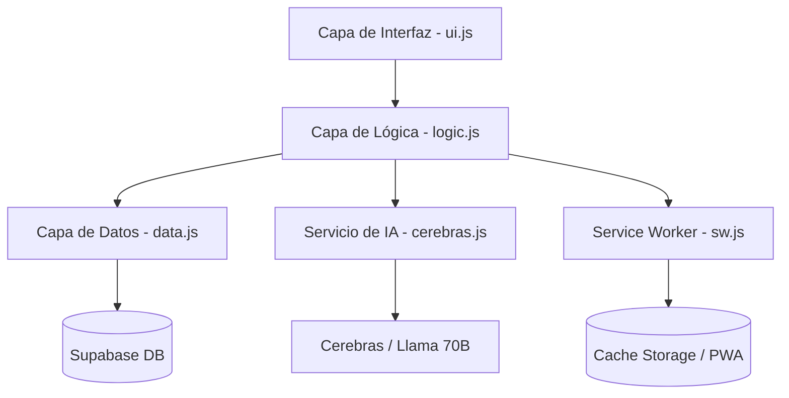

# Arquitectura de Panel-Maria (KAI) 🗺️

Este documento describe la arquitectura técnica, los patrones de diseño y el flujo de datos de la aplicación.

## 🏛️ Modelo de Capas

La aplicación sigue un patrón de arquitectura desacoplada en capas sobre Vanilla JavaScript:

### 1. Capa de Interfaz (UI) - `ui.js`
Responsable exclusivamente de la manipulación del DOM, el renderizado de componentes y la gestión de la estética tipo "Bento".
- **Componentes Dinámicos**: Tarjetas expandibles, widgets de logros, widgets de enfoque diario.
- **Gestión de Estados**: Maneja la transición entre vistas colapsadas y expandidas de los ítems.

### 2. Capa de Lógica (Controller) - `logic.js`
El "cerebro" central que orquestra la aplicación.
- **Ciclo de Vida**: Inicializa auth, carga ítems y configura suscripciones en tiempo real.
- **Gestión de Intenciones**: Procesa el texto del usuario para determinar si es una tarea, nota o proyecto (NLP offline + AI).
- **Sistema de Alarmas**: Orquestra la programación de alertas locales y notificaciones push remotas.

### 3. Capa de Datos (Persistence) - `data.js` / `supabase.js`
Abstracción de la base de datos.
- **Adaptadores**: Permite alternar entre `LocalStorage` (Modo Demo) y `Supabase` (Producción) de forma transparente para el controlador.
- **Sincronización**: Utiliza los canales de Supabase para mantener la UI actualizada sin refrescos manuales.

### 4. Capa de IA (Intelligence) - `cerebras.js` / `ai.js`
Interfaz con modelos de lenguaje de gran tamaño (LLM).
- **Kai AI**: Procesa conversaciones complejas y devuelve acciones estructuradas (JSON) que el controlador ejecuta.

## 🔄 Flujo de Datos: Creación de un Ítem

1.  **Entrada**: El usuario escribe en `item-input` o usa voz.
2.  **Análisis Local**: `logic.js` usa Regex/Keywords para una respuesta instantánea (Offline-first).
3.  **Enriquecimiento AI**: Si hay conexión, `cerebras.js` analiza el contexto para clasificar el ítem y extraer tags/alarmas.
4.  **Persistencia**: `data.js` envía el objeto transformado a Supabase.
5.  **Notificación**: Si es una alarma, se registra en la tabla `fcm_tokens` y se programa una Edge Function.
6.  **Realtime**: Supabase notifica del cambio, `logic.js` recarga la lista y `ui.js` renderiza la nueva tarjeta Bento.

## 📱 Estrategia PWA y Offline

- **Service Worker (`sw.js`)**: Cachea todos los assets estáticos (HTML, CSS, JS, Fuentes).
- **Modo Demo**: Permite a los usuarios probar la app sin cuenta usando `localStorage`, facilitando la adopción y el testing.

---
Última actualización: Marzo 2026
