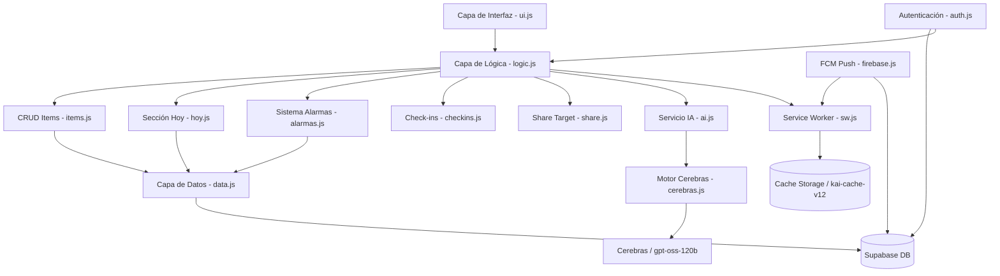

# Arquitectura de Panel-Maria (KAI) 🗺️

Este documento describe la arquitectura técnica, los patrones de diseño y el flujo de datos de la aplicación.

## 🏛️ Modelo de Capas

La aplicación sigue un patrón de arquitectura desacoplada en capas sobre Vanilla JavaScript con ES Modules:

## 📦 Módulos Actuales (14 módulos)

### Capa de Interfaz (UI)

#### `ui.js` — Sistema de Renderizado
Responsable de toda la manipulación del DOM y componentes visuales.
- **Cards Bento**: Renderizado colapsado/expandido con temas por tipo (nota, tarea, proyecto, directorio)
- **Edición Inline**: Formularios dinámicos con "Wishbar" para revelar secciones (tareas, descripción, links, alarma)
- **Chat Kai**: Ventana de chat con burbujas de mensajes y estado "thinking"
- **Dashboard de Logros**: Vista especial para items con tag "logro"
- **Agrupación por Fecha**: Items organizados en separadores temporales (Hoy, Ayer, esta semana, etc.)
- **Múltiples URLs**: Soporte para arrays de URLs con previsualización clicable

#### `utils.js` — Utilidades Compartidas
Funciones transversales usadas por todos los módulos.
- **Sanitización**: `sanitizeInput()` con escape HTML, `sanitizeHtml()`, `stripHtml()`
- **Formateo**: `formatDate()`, `timeAgo()` con localización español
- **Performance**: `debounce()`, `throttle()`
- **Storage**: Wrapper de localStorage con JSON serialización
- **Parseo**: `parseTags()`, `extractUrls()`, `slugify()`

### Capa de Control (Controller)

#### `logic.js` — KaiController (Controlador Central)
Orquestador principal de la aplicación (~1400+ líneas).
- **Inicialización**: Auth, UI, alarmas, realtime subscription, estado persistido
- **Navegación**: Timeline vs sección "Hoy", breadcrumb, categorías, tags
- **CRUD**: Crear, editar, borrar, completar items con análisis offline + IA
- **Análisis Offline**: `parseInputOffline()` — detección de URLs, checklists, proyectos, alarmas, repeticiones
- **Integración IA**: `handleKaiChat()`, `executeKaiAction()` — 10 tipos de acción JSON
- **Persistencia de Estado**: `saveState()`/`restoreState()` — vista actual, card expandida, filtros
- **Eventos**: Delegación de clicks, auth listeners, voice, share target, búsqueda

### Capa de Datos (Persistence)

#### `data.js` — Abstracción de Datos
Capa de acceso a Supabase con sanitización automática.
- **CRUD**: `createItem()`, `getItems()`, `updateItem()`, `deleteItem()`
- **Búsqueda Full-Text**: Usa RPC `search_items` con fallback a `ILIKE`
- **Sanitización**: Todos los inputs se sanitizan antes de persistir
- **Múltiples URLs**: Campo `urls` como array, con compatibilidad backward para `url`
- **Meta Data**: Campo `meta` JSONB para datos extendidos (check-ins, energía, etc.)

#### `supabase.js` — Configuración
Cliente Supabase y constantes de configuración.
- **Tipos canónicos**: `nota`, `tarea`, `proyecto`, `directorio`
- **Migración de tipos**: `migrarTipo()` convierte tipos antiguos (inglés) a español
- **Iconos y colores**: Mapeo por tipo para UI

#### `items.js` — Gestión de Items
CRUD de alto nivel con notificaciones UI.
- **Operaciones**: `load()`, `create()`, `update()`, `delete()`, `finish()`, `togglePin()`
- **Import/Export**: JSON backup con formato `Panel-Maria-KAI`
- **Extracción de URLs**: `extractUrl()` para detección automática

### Capa de Inteligencia (AI)

#### `cerebras.js` — Motor de IA
Integración con Cerebras API para procesamiento de lenguaje natural.
- **Modelo**: `gpt-oss-120b` (sucesor de llama-3.3-70b)
- **Contexto RAG**: `getContext()` inyecta items actuales en el prompt del sistema
- **Memoria**: Historial de conversación con límite de 10 mensajes
- **Acciones JSON**: 10 tipos de acción (CREATE_ITEM, UPDATE_ITEM, DELETE_ITEM, TOGGLE_TASK, TOGGLE_PIN, OPEN_PROJECT, OPEN_EDIT, SEARCH, FILTER_CATEGORY, NO_ACTION)
- **Modo Offline**: `offlineParse()` — detección local sin API key
- **Parseo Robusto**: Auto-cierre de llaves JSON incompletas

#### `ai.js` — Voz y Detección Offline
Reconocimiento de voz y patrones de lenguaje natural.
- **Web Speech API**: `startVoice()`, `stopVoice()` con transcripción en tiempo real
- **Detección de Bitácora**: Patrones para entradas tipo diario personal
- **Detección de Alarmas**: Extracción de fechas/horas del texto natural
- **Detección de Tags**: Patrones de salud, emoción, logros

### Capa de Funcionalidades Específicas

#### `alarmas.js` — Sistema de Alarmas 2.0
Gestión completa de alarmas y recordatorios.
- **Polling Local**: Verificación cada 30s con pestaña abierta
- **Snooze**: 5, 10, 30 minutos con timers internos
- **Repeticiones**: Daily, weekly, monthly con avance automático de deadline
- **Notificación Inline**: Banner animado con acciones de snooze
- **Push Remoto**: Invoca Edge Function `check-alarms` para notificaciones con app cerrada
- **Prioridad**: Títulos diferenciados por tag (urgente, salud, trabajo)

#### `hoy.js` — Sección "Hoy"
Gestión de rutinas diarias, tareas del día y check-ins.
- **Rutinas**: CRUD de rutinas diarias con completitud (Supabase + localStorage fallback)
- **Tareas Diarias**: Crear, completar, eliminar tareas específicas del día
- **Check-ins**: Guardar estado emocional y físico diario
- **Fallback Local**: Todas las operaciones funcionan sin autenticación

#### `checkins.js` — Check-ins de Bienestar
Sistema de seguimiento emocional y de energía.
- **3 Momentos**: Mañana (10h), Tarde (15h), Noche (21h)
- **Energía**: Escala 0-10 con iconos y labels
- **Emoción**: 10 estados emocionales con iconos
- **Notificaciones**: Programación automática por momento del día
- **Tendencias**: `calculateTrend()` promedios por momento y emoción dominante
- **Historial**: Últimos 7 días configurable

#### `share.js` — Share Target
Recepción y clasificación de contenido compartido.
- **Detección**: URL params (`title`, `text`, `url`) y Launch Queue API
- **Clasificación**: Sugerencia automática de tipo según contenido
- **Modal de Previsualización**: Preview del enlace, título editable, dominio
- **Selector de Card**: Lista de cards existentes para agregar URL
- **Dual Action**: "Guardar como nueva card" o "Agregar a card existente"
- **Múltiples URLs**: Agrega URLs al array existente sin duplicar

#### `firebase.js` — Firebase Cloud Messaging
Gestión de tokens y notificaciones push.
- **Token FCM**: Generación, almacenamiento y refresh automático (>6 días)
- **Push Subscription**: VAPID key con subscribe al push manager
- **Foreground Messages**: Manejo de notificaciones con app abierta
- **Sync con Supabase**: Guarda tokens en tabla `fcm_tokens` para multi-dispositivo
- **Stale Detection**: `isTokenStale()` verifica antigüedad del token

#### `auth.js` — Autenticación
Gestión de sesiones con Supabase Auth.
- **Proveedores**: Google OAuth, Email/Password
- **Redirección**: Dinámica según entorno (localhost vs GitHub Pages)
- **Eventos**: Dispatch de `auth-SIGNED_IN`, `auth-SIGNED_OUT` con session data
- **Estado**: `currentUser` persistente vía SDK de Supabase

## 🔄 Flujo de Datos: Creación de un Ítem

1. **Entrada**: Usuario escribe en `#item-input` o usa dictado por voz.
2. **Análisis Offline**: `logic.js` ejecuta `parseInputOffline()` — detecta URLs, checklists, tipos, alarmas, repeticiones (respuesta instantánea, funciona offline).
3. **Enriquecimiento con IA**: Si hay API key, `cerebras.ask()` analiza el contexto y genera título, descripción, tipo y tags óptimos.
4. **Persistencia**: `data.createItem()` envía el objeto sanitizado a Supabase con todos los campos (content, descripcion, type, urls[], tareas[], tags[], deadline, repeat, meta).
5. **Alarma Automática**: Si tiene deadline, el trigger DB `trg_sync_alarm_notification` crea registro en `alarm_notifications`. El cron `check-alarms` del servidor envía push en el momento correcto.
6. **Realtime**: Supabase notifica el cambio vía channel `public:items`, `logic.js` recarga silenciosamente con debounce de 1s, y `ui.js` re-renderiza las cards.
7. **Estado Persistido**: La card expandida y la vista actual se guardan en `localStorage` (`kai_state`).

## 📱 Estrategia PWA y Offline

### Service Worker (`sw.js`)
- **Versión de caché**: `kai-cache-v12`
- **Estrategias de caché**:
  - **Cache-First**: Fonts, imágenes, JS, CSS estáticos
  - **Network-First**: APIs (Supabase, Cerebras)
  - **Stale-While-Revalidate**: HTML, manifest
- **Firebase Messaging**: Integrado con `onBackgroundMessage()` para push notifications
- **Acciones de Notificación**: Snooze 5min, snooze 10min, dismiss — comunicados vía `postMessage` al cliente
- **Prioridad**: Vibración diferenciada para alarmas high vs normal
- **Auto-update**: Detecta nuevo SW y recarga con safeguard de 10s

### Manifest (`manifest.json`)
- **Share Target**: GET con params `title`, `text`, `url`
- **Shortcuts**: "Nueva Idea" (`?action=new&type=nota`), "Nueva Tarea" (`?action=new&type=tarea`)
- **Screenshots**: Configurado para narrow form factor (390x844)
- **Display**: Standalone con iconos 192, 512 y maskable

### Modo Offline
- Sin autenticación: estado vacío con invitación a iniciar sesión
- Check-ins, rutinas y tareas de "Hoy" funcionan con localStorage fallback
- Análisis offline de input (`parseInputOffline`) sin necesidad de IA

---
Última actualización: Abril 2026
